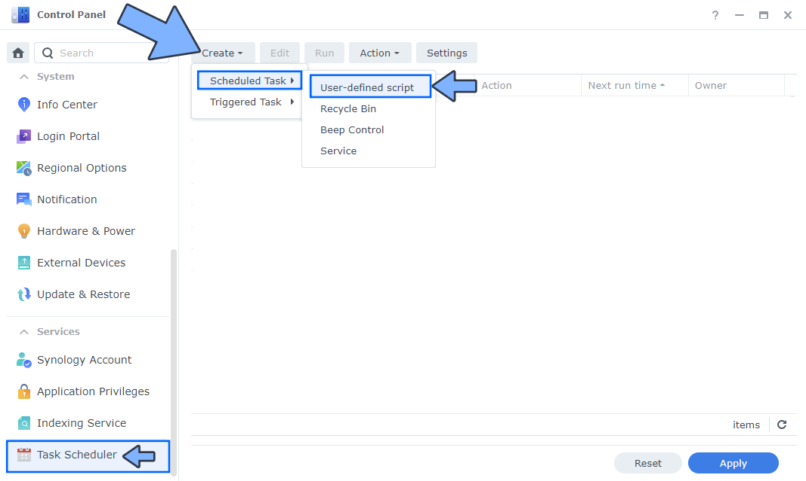

# Tutorial Como Instalar Jira

## Primer Paso

Buscar Container manager en el Package center e instalarlo a no ser que tengas una versión por debajo de la 7.2 en ese caso deberías bucar e instalar por nombre de docker

## Segundo Paso

Dentro de la gestión de archivos crea una carpeta llamada jira en el apartado de docker

## Tercer Paso
Luego abrimos el panel de control y hacemos lo siguiente

## Cuarto Paso
- General: en el campo Tarea, escriba Instalar Jira. Desmarque la opción "Habilitado". Seleccione Usuario raíz.
- Programar: seleccione Ejecutar en la siguiente fecha y luego seleccione "No repetir".
- Configuración de tareas: marque "Enviar detalles de ejecución por correo electrónico", agregue su correo electrónico y luego copie y pegue el código a continuación en el área de comando Ejecutar. Después de eso, haga clic en Aceptar.

docker run -d --name=jira \
-p 8059:8080 \
-v /volume1/docker/jira:/var/atlassian/application-data/jira \
--restart always \
atlassian/jira-software

(Si te sale un waring dale al ok  y introduce la contraseña en caso que te la pida y sigue con las instrucciones)

## Quinto Paso
Ejecuta la task que acabas de crear aceptando los popups que te salten

## Sexto Paso
Ejecutando ese proceso te permite que si usas el navegador y ejecutas este link con tu propia ip http://(TuIp):8059 te saldrá el setup del jira

## Septimo Paso

Te saldrá esta interfaz, a partir de aqui has de configurar el setup del jira a tus gustos, clica en "Set it up for me" si quieres hacerlo del modo ràpido y facil, en cambio deberias darle a "I'll set it up by myself" en caso que quieras una instalación con unos parametros muy especificos como por ejemplo ambientados en la base de datos donde irá almacenado todo

